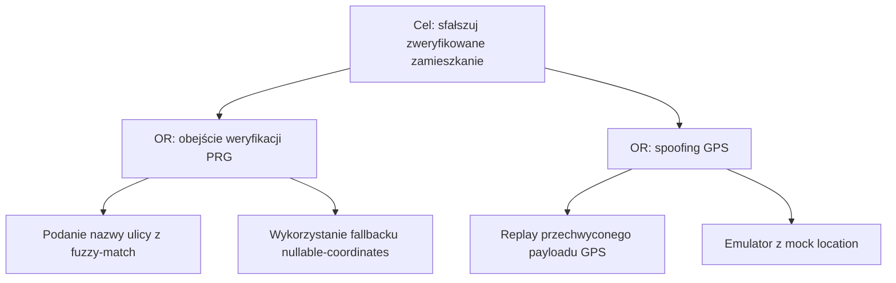

# Threat Model Template
> **Wersja PL/LocalHero — zlokalizowana z generic upstream w
> `claude-patterns/templates/THREAT_MODEL_TEMPLATE.md`.**
> Różnice świadome: język polski, przykłady B2G/LH-specific (TM-B2G-XXX),
> reference do `SECURITY_STRATEGY.md §3 Warstwa 2`. Synchronizacja
> sekcji STRIDE/DREAD/LINDDUN warto okresowo (gdy upstream się
> rozszerza), ale tłumaczenie i przykłady pozostają lokalne.
>
> Skopiuj ten plik do `docs/security/threat-models/TM-{TASK-ID}.md` i wypełnij.  
> Trigger: patrz decision tree w `SECURITY_STRATEGY.md §3 Warstwa 2`.  
> Skill: `/threat-model` prowadzi przez ten plik interaktywnie.

---

## Nagłówek

| Pole | Wartość |
|------|---------|
| **TM-ID** | TM-{TASK-ID} (np. TM-B2G-001) |
| **Tytuł** | |
| **Autor** | |
| **Data** | |
| **Related task** | TS-XXX-YYY |
| **Bounded context** | |
| **Status** | DRAFT / IN-REVIEW / APPROVED |
| **Reviewer** | Tech Lead sign-off |

---

## Sekcja 1 — Scope

### Co jest w scope
> Jakie komponenty, endpointy, aggregaty, przepływy danych analizujemy?

- Aggregate: 
- Endpointy: 
- Data flows: 
- Zewnętrzne integracje: 

### Co jest poza scope
> Co celowo pomijamy i dlaczego?

- 

### Aktorzy (kto wchodzi w interakcję z systemem)

| Aktor | Zaufanie | Opis |
|-------|----------|------|
| Authenticated user (resident) | Medium | Zalogowany mieszkaniec z zweryfikowanym adresem |
| Anonymous user | Low | Niezalogowany, ograniczony dostęp |
| InstitutionalSender | Medium-High | Zweryfikowana instytucja publiczna |
| LocalHero Admin | High | Wewnętrzny admin platformy |
| External system (FCM, PayU, SMS) | Low-Medium | Zewnętrzny provider |
| *Dodaj specyficznych dla tego TM* | | |

### Chronione aktywa (co chronimy)

| Aktywo | Klasyfikacja | Dlaczego krytyczne |
|--------|-------------|-------------------|
| | PII / Poufne / Wewnętrzne / Publiczne | |

> Klasyfikacja: **PII wrażliwe** (PESEL, coordinates, dane medyczne) / **PII zwykłe** (email, nazwa) / **Poufne** (klucze, tokeny) / **Wewnętrzne** (logi, metryki) / **Publiczne**

---

## Sekcja 2 — Data Flow Diagram (DFD)

> Narysuj przepływ danych w Mermaid. Zaznacz trust boundaries (`subgraph`).  
> Kluczowe elementy: External Entities (użytkownicy, systemy zewnętrzne), Processes (handlery, serwisy), Data Stores (DB, Redis, cache), Data Flows (strzałki z opisem danych).

```mermaid
flowchart TD
    subgraph "Trust Boundary: Internet (untrusted)"
        USER([User / Browser])
        EXT([External System])
    end

    subgraph "Trust Boundary: LocalHero API (trusted)"
        CTRL[Controller\n@RequirePermissions]
        HANDLER[CommandHandler\n@Transactional]
        DOMAIN[Aggregate / Domain Service]
    end

    subgraph "Trust Boundary: Data Layer (high trust)"
        DB[(PostgreSQL\nPII encrypted at rest)]
        REDIS[(Redis\nrate limit / sessions)]
    end

    USER -->|HTTPS — request body bez userId| CTRL
    CTRL -->|DTO validated by Zod| HANDLER
    HANDLER -->|Result<T>| DOMAIN
    DOMAIN -->|Repository.save| DB
    HANDLER -->|Rate limit check| REDIS
    EXT -->|Webhook / callback| CTRL
```

> Dodaj do diagramu **trust boundaries** jako subgraphy, zaznacz gdzie dane są PII, gdzie szyfrowane.

---

## Sekcja 3 — STRIDE Analysis

> Dla każdego głównego komponentu / trust boundary z DFD przeanalizuj zagrożenia STRIDE.  
> Wypełnij tylko te kategorie, gdzie identyfikujesz realne ryzyko — reszta: N/A.

### Jak używać STRIDE

| Litera | Zagrożenie | Pytanie które zadajesz |
|--------|-----------|----------------------|
| **S** | Spoofing | Czy atakujący może podszyć się pod legalnego użytkownika / system? |
| **T** | Tampering | Czy atakujący może zmodyfikować dane w transporcie lub w magazynie? |
| **R** | Repudiation | Czy użytkownik może zaprzeczyć swojej akcji? Czy akcja jest auditowalna? |
| **I** | Information Disclosure | Czy atakujący może odczytać dane do których nie ma prawa? |
| **D** | Denial of Service | Czy atakujący może uniemożliwić korzystanie z systemu? |
| **E** | Elevation of Privilege | Czy atakujący może uzyskać wyższe uprawnienia niż mu przysługują? |

---

### STRIDE per komponent

> **Full tier — kolumna MITRE ATT&CK:** zmapuj każde realne zagrożenie na technikę ATT&CK (T-ID),
> np. Spoofing→T1078 (Valid Accounts), Tampering→T1565 (Data Manipulation), Info Disclosure→T1213,
> EoP→T1068. Daje realizm + konkretny hook dla detekcji (każde T-ID ma udokumentowane detekcje).

#### Komponent: [nazwa — np. PublishBroadcastHandler]

| Kategoria | Zagrożenie | Scenariusz ataku | MITRE ATT&CK | Mitygacja (jest) | Gap (brakuje) |
|-----------|-----------|-----------------|--------------|------------------|---------------|
| **S** Spoofing | | | | | |
| **T** Tampering | | | | | |
| **R** Repudiation | | | | | |
| **I** Info Disclosure | | | | | |
| **D** DoS | | | | | |
| **E** EoP | | | | | |

#### Komponent: [nazwa — np. CivicAudienceBuilder ACL call]

| Kategoria | Zagrożenie | Scenariusz ataku | MITRE ATT&CK | Mitygacja (jest) | Gap (brakuje) |
|-----------|-----------|-----------------|--------------|------------------|---------------|
| **S** | | | | | |
| **T** | | | | | |
| **R** | | | | | |
| **I** | | | | | |
| **D** | | | | | |
| **E** | | | | | |

> Dodaj tyle bloków ile komponentów/trust boundaries masz w scope.

---

## Sekcja 3b — Attack Trees (full tier — zagrożenia krytyczne)

> Dla każdego zagrożenia Krytycznego (DREAD ≥ 12 lub CVSS ≥ 7.0) rozłóż atak na drzewo:
> korzeń = cel atakującego, gałęzie = pod-cele (OR = alternatywy, AND = wymagane razem), liście =
> konkretne metody. Ujawnia **najtańszą ścieżkę ataku** i **punkt mitygacji o największej dźwigni**
> (węzeł, który odcina najwięcej liści).

#### Drzewo: [cel atakującego — np. sfałszowanie zweryfikowanego zamieszkania]



> Dla każdego liścia: wykonalność · mitygacja która go blokuje · ryzyko rezydualne · link do TM-ID (i ATT&CK).

---

## Sekcja 4 — DREAD Risk Scoring

> Dla każdego zagrożenia zidentyfikowanego w STRIDE oceń ryzyko przez DREAD.  
> Score = suma D+R+E+A+D (zakres 5–15). Progi: **≥ 12 = Krytyczny**, **9–11 = Wysoki**, **6–8 = Średni**, **5 = Niski**.

### Jak używać DREAD

| Litera | Wymiar | 1 — Niskie | 2 — Średnie | 3 — Wysokie |
|--------|--------|-----------|------------|------------|
| **D** | Damage | Minimalne uszkodzenie, brak wycieku danych | Wyciek danych < 100 osób, ograniczona usługa | Wyciek PII wrażliwych, platforma niedostępna, utrata kontraktu |
| **R** | Reproducibility | Atak trudny do powtórzenia, zależy od szczególnych warunków | Atak powtarzalny przez doświadczonego atakującego | Atak w pełni powtarzalny przez każdego z dostępem do Internetu |
| **E** | Exploitability | Wymaga głębokiej wiedzy, fizycznego dostępu lub insider | Exploit wymaga wiedzy o systemie, dostępnych narzędzi | Dostępny publiczny exploit, narzędzie point-and-click |
| **A** | Affected users | < 10 użytkowników | 10–1000 użytkowników | > 1000 użytkowników lub wszyscy użytkownicy B2G gminy |
| **D** | Discoverability | Bardzo trudne do odkrycia, wymaga kodu źródłowego | Wymaga aktywnego skanowania | Widoczne publicznie, łatwe do odkrycia przez recon |

---

### DREAD Risk Register

| TM-ID | Komponent | Zagrożenie (STRIDE ref) | D | R | E | A | D | **Score** | Priorytet | Owner | Status |
|-------|-----------|------------------------|---|---|---|---|---|-----------|-----------|-------|--------|
| TM-XXX-001 | | S: Spoofing sesji | | | | | | | | | OPEN |
| TM-XXX-002 | | I: PII w error response | | | | | | | | | OPEN |
| TM-XXX-003 | | E: Brak rate limit na endpoint | | | | | | | | | MITIGATED |

> **Status**: OPEN / IN-PROGRESS / MITIGATED / ACCEPTED (z uzasadnieniem)  
> **Priorytet**: Krytyczny (≥12) / Wysoki (9–11) / Średni (6–8) / Niski (5)

### Opcja CVSS (full tier — dla konkretnych podatności)

> DREAD to szybki, subiektywny triaż design-time. Dla znalezisk mapujących się na **konkretną,
> wykorzystywalną podatność** (CVE-podobne lub raportowane/śledzone zewnętrznie) użyj **CVSS v3.1**
> zamiast/obok DREAD — wektor + base score (0–10). CVSS jest powtarzalny i branżowo-standardowy.
> Mapowanie: **≥ 9.0 Krytyczny · 7.0–8.9 Wysoki · 4.0–6.9 Średni · < 4.0 Niski**.

| TM-ID | Podatność | Wektor CVSS v3.1 | Base | Severity |
|-------|-----------|------------------|------|----------|
| TM-XXX-00N | | `CVSS:3.1/AV:N/AC:L/PR:N/UI:N/S:U/C:H/I:H/A:N` | | |

> Zaznacz w rejestrze, który system (DREAD czy CVSS) dał score danego wiersza — żeby priorytety były porównywalne.

---

## Sekcja 5 — LINDDUN Privacy Analysis

> LINDDUN uzupełnia STRIDE o wymiar prywatności — kluczowy dla RODO/GDPR, DPIA i B2G.  
> Analizuj per **przepływ danych** i **magazyn danych** z DFD.  
> Pomijaj N/A z uzasadnieniem; nie pomijaj bez uzasadnienia.

### Jak używać LINDDUN

| Litera | Zagrożenie prywatności | Pytanie które zadajesz |
|--------|----------------------|----------------------|
| **L** | Linkability | Czy atakujący może powiązać dwa rekordy / sesje / zdarzenia dotyczące tej samej osoby, nawet jeśli są pseudonimizowane? |
| **I** | Identifiability | Czy atakujący może zidentyfikować konkretną osobę na podstawie danych (nawet anonimizowanych)? |
| **N** | Non-repudiation | Czy osoba fizyczna jest zmuszona do pozostawienia śladu (nie może działać anonimowo), co może jej zaszkodzić? |
| **D** | Detectability | Czy atakujący może wykryć *że* osoba jest w systemie (existence disclosure), nawet jeśli nie zna treści? |
| **D** | Disclosure of information | Czy nieuprawniony podmiot może uzyskać dostęp do prywatnych danych osoby? |
| **U** | Unawareness | Czy osoba nie zdaje sobie sprawy z przetwarzania jej danych (brak transparency, RODO Art. 13/14)? |
| **N** | Non-compliance | Czy przetwarzanie narusza RODO, KSC, ustawę o dostępności, inne regulacje? |

---

### LINDDUN per przepływ / magazyn danych

#### Przepływ/Magazyn: [nazwa — np. `residence_verifications` table]

| Zagrożenie | Dotyczy? | Opis zagrożenia | Mitygacja (jest) | Gap |
|-----------|---------|----------------|-----------------|-----|
| **L** Linkability | TAK/NIE | | | |
| **I** Identifiability | TAK/NIE | | | |
| **N** Non-repudiation | TAK/NIE | | | |
| **D** Detectability | TAK/NIE | | | |
| **D** Disclosure | TAK/NIE | | | |
| **U** Unawareness | TAK/NIE | | | |
| **N** Non-compliance | TAK/NIE | | | |

#### Przepływ/Magazyn: [nazwa — np. `CivicAudience in-memory list`]

| Zagrożenie | Dotyczy? | Opis zagrożenia | Mitygacja (jest) | Gap |
|-----------|---------|----------------|-----------------|-----|
| **L** Linkability | | | | |
| **I** Identifiability | | | | |
| **N** Non-repudiation | | | | |
| **D** Detectability | | | | |
| **D** Disclosure | | | | |
| **U** Unawareness | | | | |
| **N** Non-compliance | | | | |

> Dodaj bloki dla każdego data store i każdego data flow który przetwarza PII.

### LINDDUN — wymagane działania RODO

> Na podstawie LINDDUN określ jakie obowiązki RODO są triggerowane.

| Zagrożenie LINDDUN | Triggeruje | Action |
|--------------------|-----------|--------|
| I — Identifiability wysoka | Art. 25 privacy by design | Pseudonimizacja / minimalizacja |
| N — Non-repudiation (user forced accountability) | Art. 22 automatyczne decyzje | Appeal workflow |
| U — Unawareness | Art. 13/14 informacja | Aktualizacja Polityki Prywatności |
| N — Non-compliance | Art. 35 DPIA | Przeprowadzić DPIA przed wdrożeniem |
| L + I — Linkability + Identifiability na dużą skalę | Art. 35 + DPIA | Obowiązkowa DPIA |

---

## Sekcja 6 — Consolidated Risk Register

> Pełna lista zagrożeń z STRIDE + LINDDUN z priorytetem i statusem.  
> To jest "jedno miejsce" do trackowania — aktualizować po każdej zmianie.

| ID | Metodologia | Komponent | Zagrożenie | DREAD Score | Priorytet | Mitygacja | Status | Deadline |
|----|------------|-----------|-----------|-------------|-----------|-----------|--------|----------|
| TM-XXX-001 | STRIDE-S | | | | Krytyczny | | OPEN | |
| TM-XXX-002 | LINDDUN-I | | | n/a (privacy) | Wysoki | | OPEN | |
| TM-XXX-003 | STRIDE-D | | | | Średni | | MITIGATED | |

---

## Sekcja 7 — Mitygacje i plan implementacji

> Dla każdego OPEN zagrożenia z priorytetem Krytyczny/Wysoki — konkretny plan.

### Krytyczne (score ≥ 12 lub LINDDUN Non-compliance)

| Zagrożenie ID | Co implementujemy | Wzorzec / ADR | Task | Deadline |
|--------------|-------------------|---------------|------|----------|
| TM-XXX-001 | | `architecture/dual-identity-pattern.md` | TS-XXX | |

### Wysokie (score 9–11)

| Zagrożenie ID | Co implementujemy | Task | Deadline |
|--------------|-------------------|------|----------|
| | | | |

### Akceptowane ryzyka (ACCEPTED)

> Ryzyka które świadomie akceptujemy z uzasadnieniem i re-review date.

| Zagrożenie ID | Powód akceptacji | Re-review date | Zaakceptował |
|--------------|-----------------|---------------|-------------|
| | | | Tech Lead |

---

## Sekcja 8 — Checklist compliance przed sign-off

> Muszą być zaznaczone wszystkie zanim TM przejdzie do statusu APPROVED.

**STRIDE:**
- [ ] Każdy komponent z DFD ma wypełnione co najmniej 3 kategorie STRIDE (nie same N/A bez uzasadnienia)
- [ ] Każde zagrożenie ma DREAD score
- [ ] Brak zagrożeń Krytycznych w statusie OPEN bez przypisanego tasku i deadline

**LINDDUN:**
- [ ] Każdy data store z PII ma wypełniony blok LINDDUN
- [ ] Każdy data flow z PII ma wypełniony blok LINDDUN
- [ ] Non-compliance (N) — jeśli TAK → DPIA triggerowana (lub uzasadnienie dlaczego nie)
- [ ] Unawareness (U) — jeśli TAK → Polityka Prywatności zaktualizowana lub task stworzony

**RODO:**
- [ ] Określono podstawę prawną przetwarzania (Art. 6 / Art. 9 RODO)
- [ ] Określono retencję danych i mechanizm usunięcia (crypto-shredding / anonymization)
- [ ] Jeśli automatyczne profilowanie z decyzją → Art. 22 appeal workflow istnieje lub jest w tasklist

**Kod:**
- [ ] Dual Identity: userId nie przyjmowany z body requestu
- [ ] Rate limiting: fail-closed (nie fail-open przy awarii Redisa)
- [ ] Error handling: safe-error-propagation pattern (infrastruktura nie wycieka do HTTP response)
- [ ] Audit: Tier-1 event dla operacji modyfikujących PII innych użytkowników

---

## Sekcja 9 — Sign-off

| Rola | Imię | Data | Uwagi |
|------|------|------|-------|
| Autor TM | | | |
| Tech Lead (review) | | | |
| CISO / Security owner | | | — jeśli TM dotyczy B2G lub EMERGENCY |

---

## Appendix — Wzorce do przeczytania przed wypełnieniem

Przed analizą przeczytaj wzorce które rządzą tym obszarem:

| Wzorzec | Ścieżka | Kiedy krytyczny |
|---------|---------|-----------------|
| Dual Identity | `.claude/knowledge/patterns/architecture/dual-identity-pattern.md` | Każdy handler z userId |
| Golden Rule Endpoints | `.claude/knowledge/patterns/architecture/golden-rule-endpoints.md` | Każdy nowy controller |
| Safe Error Propagation | `.claude/knowledge/patterns/cross-layer/safe-error-propagation-pattern.md` | Każdy error path |
| ACL Registry | `.claude/knowledge/patterns/architecture/acl-registry-pattern.md` | Cross-context calls |
| Domain Errors | `.claude/knowledge/patterns/cross-layer/domain-errors-pattern.md` | Result<T> failure paths |
| Transactional | `.claude/knowledge/patterns/architecture/transactional-pattern.md` | @Transactional handlers |

---

## Appendix — Przykład wypełnionego bloku (STRIDE + DREAD + LINDDUN)

> Przykład dla InstitutionalBroadcast EMERGENCY (TM-B2G-001).  
> Usuń ten appendix z docelowego TM-{ID}.md po wypełnieniu.

### STRIDE — przykład

| Kategoria | Zagrożenie | Scenariusz | Mitygacja | Gap |
|-----------|-----------|-----------|-----------|-----|
| **S** Spoofing | Przejęcie sesji InstitutionalSender | Atakujący kradnie token (30d expiry), publikuje fałszywy EMERGENCY alert dla 8K mieszkańców | JWT + RBAC + `@RequirePermissions` | Brak step-up auth przed EMERGENCY publish; JWT za długo ważny dla B2G |
| **E** EoP | Tier MUNICIPAL publikuje EMERGENCY | Sender z tier MUNICIPAL (nie ma grantu EMERGENCY) modyfikuje request body `broadcastType: EMERGENCY` | `PolicyBuilder.must(SenderHasGrantSpec)` | Sprawdzić czy Spec istnieje i jest testowana w L1 |

### DREAD — przykład

| TM-ID | Zagrożenie | D | R | E | A | D | Score | Priorytet |
|-------|-----------|---|---|---|---|---|-------|-----------|
| TM-B2G-001 | Fałszywy EMERGENCY alert | 3 | 2 | 2 | 3 | 2 | **12** | Krytyczny |
| TM-B2G-002 | Tier bypass EMERGENCY grant | 3 | 1 | 2 | 3 | 1 | **10** | Wysoki |

### LINDDUN — przykład

#### Magazyn: `CivicAudience (in-memory list userId)`

| Zagrożenie | Dotyczy? | Opis | Mitygacja | Gap |
|-----------|---------|------|-----------|-----|
| **L** Linkability | TAK | userId powiązany z TERYT → można zlinkować miejsce zamieszkania z aktywnością | userId nie persystowany; lista in-memory tylko podczas delivery | Brak TTL na in-memory scope jeśli delivery się zawiesi |
| **I** Identifiability | TAK | Lista userId + TERYT code = de-facto identyfikacja mieszkańców gminy | userId jest pseudonimem; real identity tylko w auth BC przez ACL | Brak RLS na `residence_verifications` — insider może SELECTować wszystkich |
| **N** Non-compliance | TAK | Przetwarzanie danych lokalizacyjnych na dużą skalę → RODO Art. 35 | — | **DPIA-GEO wymagana przed pilotem — nie istnieje** |
